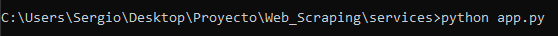

# Proyecto Web Scraping

#### Dado que Rick monta una gran fiesta, nos ha encargado desarrollar una página web con diferentes menús interdimensionales y además una aplicación que extraiga la informacón de dichos menús.                                Por petición de un alumno de segundo, la información extraída se alojará en una base de datos en MongoDB.

# Lanzamiento Aplicación
#### Para lanzar aplicación es necesario lanzar el archivo app.py, ya sea iniciandolo desde la interfaz gráfica o desde la terminal con el comando 

# Autores
#### Alicia Tugores y Sergio González
# Agradecimientos 
#### Todo el grupo de Ping Pong por el apoyo emocional y sobretodo a San Google, sin ti no somos nada :)
